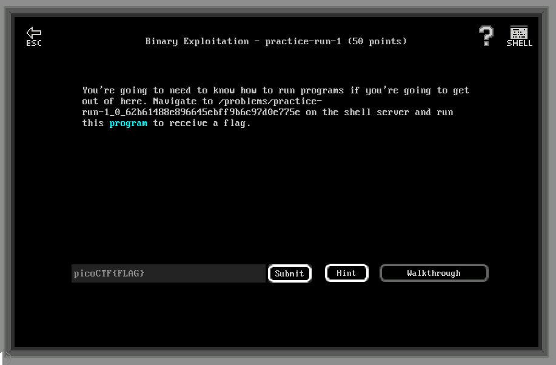

# Binary Exploitation - practice-run-1 (50 points)

## Challenge

*You're going to need to know how to run programs if you're going to get out of here. Navigate to /problems/practice-run-1_0_62b61488e896645ebff9b6c97d0e775e on the shell server and run this program to receive a flag.*



## Flag

picoCTF{g3t_r3adY_2_r3v3r53}

## Walkthrough

Ok, this one is serious. Prepare all your overpowered pwn tools. First, let's run this program:

```bash
m3oow@pico-2019-shell1:~$ cd /problems/practice-run-1_0_62b61488e896645ebff9b6c97d0e775e
m3oow@pico-2019-shell1:/problems/practice-run-1_0_62b61488e896645ebff9b6c97d0e775e$ ls
run_this
m3oow@pico-2019-shell1:/problems/practice-run-1_0_62b61488e896645ebff9b6c97d0e775e$ ./run_this 
picoCTF{g3t_r3adY_2_r3v3r53}
```

¯\(°_o)/¯
