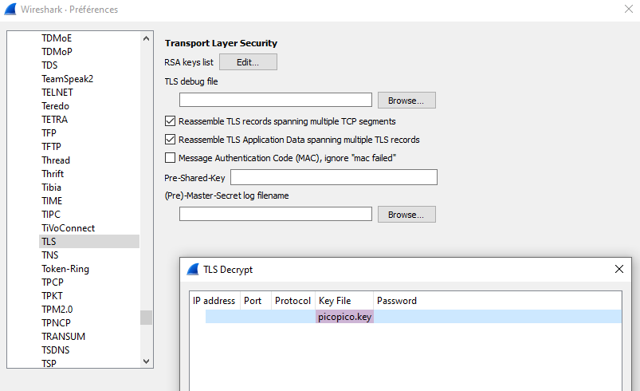
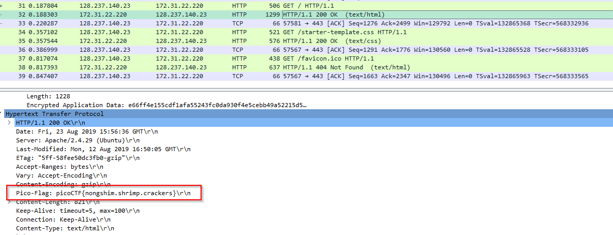

# Cryptography - WebNet0 (350 points)

## Challenge

*We found this packet [capture](./capture.pcap) and [key](./picopico.key). Recover the flag. You can also find the file in /problems/webnet0_0_363c0e92cf19b68e5b5c14efb37ed786.*

Hints:

* *Try using a tool like Wireshark*
* *How can you decrypt the TLS stream?*

## Flag

picoCTF{nongshim.shrimp.crackers}

## Walkthrough

This one is pretty easy using Wireshark. The capture is an encrypted HTTP exchange using TLS with the corresponding private key. The exchange is secured using TLSv1.2 and TLS_RSA_WITH_AES_256_GCM_SHA354. So, knowing the private key, we can easily decrypt the whole exchange by just adding the key in wireshark preferences for TLS protocol:

Which gives us the following unecnrypted trafic, and the flag included in the response headers (header *Pico-Flag*):

