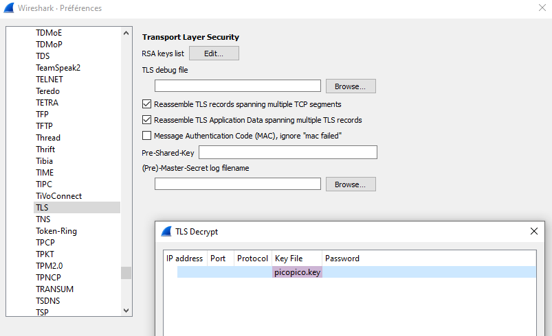
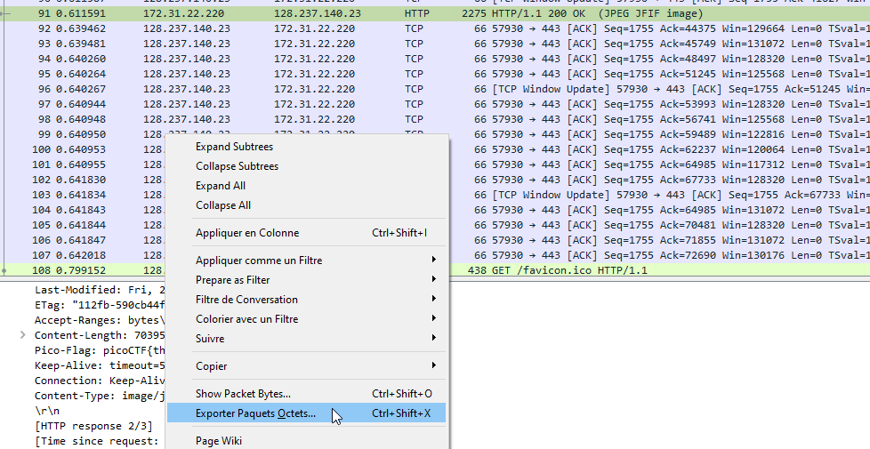

# Cryptography - WebNet1 (450 points)

## Challenge

*We found this packet [capture](./capture.pcap) and [key](./picopico.key). Recover the flag. You can also find the file in /problems/webnet1_0_d63b267c607b8fedbae100068e010422.*

Hints:

* *Try using a tool like Wireshark*
* *How can you decrypt the TLS stream?*

## Flag

picoCTF{honey.roasted.peanuts}

## Walkthrough

This one is pretty easy using Wireshark. The capture is an encrypted HTTP exchange using TLS with the corresponding private key. The exchange is secured using TLSv1.2 and TLS_RSA_WITH_AES_256_GCM_SHA354. So, knowing the private key, we can easily decrypt the whole exchange by just adding the key in wireshark preferences for TLS protocol:

Compared to WebNet0, the solution is slightly different. If you look at the HTTP exchange, an image *vulture.jpg* is transferred to our client. This image can be copied using Wireshark, the flag is a plaintext in the raw image.

