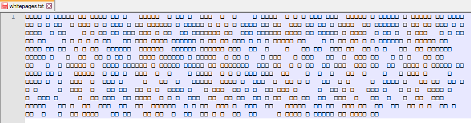

# Cryptography - WhitePages (250 points)

## Challenge

*I stopped using YellowPages and moved onto WhitePages... but [the page they gave me](./whitepages.txt) is all blank!*

## Flag

picoCTF{not_all_spaces_are_created_equal_dd5c2e2f77f89f3051c82bfee7d996ef}

## Walkthrough

Opening the file with a text editor does not help:



Let's convert those characters to their hex code:

```raw
E28083E28083E28083E2808320E2808320E28083E28083E28083E28083E2808320E28083E2808320E28083E28083E28083E2808320E28083E2808320E28083202020E28083E28083E28083E28083E280832020E2808320E28083E2808320E280832020E28083E28083E280832020E280832020E2808320202020E2808320E28083E28083E28083E280832020E2808320E2808320E2808320E28083E28083E2808320E28083E28083E280832020E28083E28083E28083E28083E2808320E2808320E28083E28083E28083E28083E2808320E2808320E28083E28083E28083E28083E2808320E28083E2808320E28083E28083E28083E2808320E28083E2808320E2808320E2808320E28083E280832020E2808320E28083E28083E2808320E2808320E2808320E28083E28083E2808320E2808320E28083E2808320E28083E28083E28083E28083E28083E2808320E2808320E28083E28083E28083E28083E2808320E2808320E2808320E2808320E2808320E28083E28083E28083E2808320E28083E2808320E28083E280832020E28083E28083E2808320E28083E2808320E28083E2808320E2808320E28083E28083E28083E280832020E28083E2808320E28083E28083E28083E28083E28083E2808320E2808320E28083E2808320E28083E2808320E28083E28083E2808320E2808320E2808320E28083E28083E28083E280832020E2808320[...]
```

We see two patterns here:

* E28083
* 20

If we try to convert thos patterns to respectively 0 (E28083) and 1 (20), we got a binary encoded string:

```raw
00001010000010010000100101110000011010010110001101101111010000110101010001000110000010100000101000001001000010010101001101000101010001010010000001010000010101010100001001001100010010010100001100100000010100100100010101000011010011110101001001000100010100110010000000100110001000000100001001000001010000110100101101000111010100100100111101010101010011100100010000100000010100100100010101010000010011110101001001010100000010100000100100001001001101010011000000110000001100000010000001000110011011110111001001100010011001010111001100100000010000010111011001100101001011000010000001010000011010010111010001110100011100110110001001110101011100100110011101101000001011000010000001010000010000010010000000110001001101010011001000110001001100110000101000001001000010010111000001101001011000110110111101000011010101000100011001111011011011100110111101110100010111110110000101101100011011000101111101110011011100000110000101100011011001010111001101011111011000010111001001100101010111110110001101110010011001010110000101110100011001010110010001011111011001010111000101110101011000010110110001011111011001000110010000110101011000110011001001100101001100100110011000110111001101110110011000111000001110010110011000110011001100000011010100110001011000110011100000110010011000100110011001100101011001010011011101100100001110010011100100110110011001010110011001111101000010100000100100001001
```

After decoding to ASCII:

```raw

picoCTF

SEE PUBLIC RECORDS & BACKGROUND REPORT
5000 Forbes Ave, Pittsburgh, PA 15213
picoCTF{not_all_spaces_are_created_equal_dd5c2e2f77f89f3051c82bfee7d996ef}

picoCTF
```
