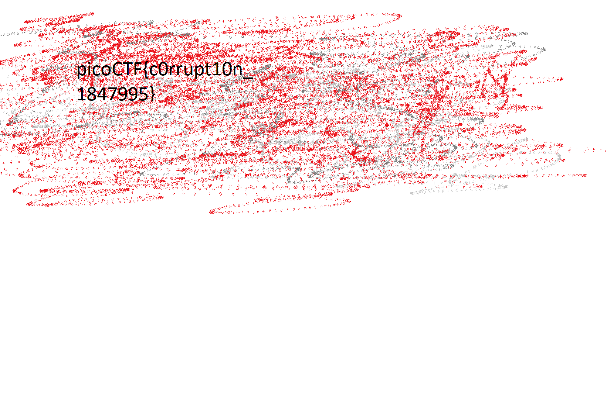

# Cryptography - c0rrupt (250 points)

## Challenge

*We found this [file](./mystery). Recover the flag. You can also find the file in /problems/c0rrupt_0_1fcad1344c25a122a00721e4af86de13.*

Hints: *Try fixing the file header.*

## Flag

picoCTF{c0rrupt10n_1847995}

## Walkthrough

At first glance, the file seems unreadable. Given the challenge title, the file content and some guessing, we suppose that this is a malformed PNG file that we have to repair. Let's take a look at the [PNG specifications](http://www.libpng.org/pub/png/spec/1.2/PNG-Structure.html):

```text
3. File Structure

A PNG file consists of a PNG signature followed by a series of chunks. This chapter defines the signature and the basic properties of chunks. Individual chunk types are discussed in the next chapter.
3.1. PNG file signature

The first eight bytes of a PNG file always contain the following (decimal) values:

   137 80 78 71 13 10 26 10

This signature indicates that the remainder of the file contains a single PNG image, consisting of a series of chunks beginning with an IHDR chunk and ending with an IEND chunk.

See Rationale: PNG file signature.
```

Let's try to modify the file header from `89 65 4E 34  0D 0A B0 AA` to `89 50 4E 47  0D 0A 1A 0A` with *hexeditor*:

```text
File: mystery                           ASCII Offset: 0x00000000 / 0x000318BB (%00)
00000000  89 50 4E 47  0D 0A 1A 0A   00 00 00 0D  43 22 44 52         .PNG........C"DR
00000010  00 00 06 6A  00 00 04 47   08 02 00 00  00 7C 8B AB         ...j...G.....|..
00000020  78 00 00 00  01 73 52 47   42 00 AE CE  1C E9 00 00         x....sRGB.......
```

```bash
root@kali:~/Downloads# pngcheck mystery
mystery:  invalid chunk name "C"DR" (43 22 44 52)
ERROR: mystery
```

Hum, something is still wrong. So let's read the next part of the PNG specification:

```text
3.2. Chunk layout

Each chunk consists of four parts:

Length
    A 4-byte unsigned integer giving the number of bytes in the chunk's data field. The length counts only the data field, not itself, the chunk type code, or the CRC. Zero is a valid length. Although encoders and decoders should treat the length as unsigned, its value must not exceed 231 bytes.

Chunk Type
    A 4-byte chunk type code. For convenience in description and in examining PNG files, type codes are restricted to consist of uppercase and lowercase ASCII letters (A-Z and a-z, or 65-90 and 97-122 decimal). However, encoders and decoders must treat the codes as fixed binary values, not character strings. For example, it would not be correct to represent the type code IDAT by the EBCDIC equivalents of those letters. Additional naming conventions for chunk types are discussed in the next section.

Chunk Data
    The data bytes appropriate to the chunk type, if any. This field can be of zero length.

CRC
    A 4-byte CRC (Cyclic Redundancy Check) calculated on the preceding bytes in the chunk, including the chunk type code and chunk data fields, but not including the length field. The CRC is always present, even for chunks containing no data. See CRC algorithm.

The chunk data length can be any number of bytes up to the maximum; therefore, implementors cannot assume that chunks are aligned on any boundaries larger than bytes.

Chunks can appear in any order, subject to the restrictions placed on each chunk type. (One notable restriction is that IHDR must appear first and IEND must appear last; thus the IEND chunk serves as an end-of-file marker.) Multiple chunks of the same type can appear, but only if specifically permitted for that type.
```

The IHDR chunk type is missing and replaced by `C"DR`, let's repair it:

```text
File: mystery                           ASCII Offset: 0x00000000 / 0x000318BB (%00)
00000000  89 50 4E 47  0D 0A 1A 0A   00 00 00 0D  49 48 44 52         .PNG........IHDR
00000010  00 00 06 6A  00 00 04 47   08 02 00 00  00 7C 8B AB         ...j...G.....|..
00000020  78 00 00 00  01 73 52 47   42 00 AE CE  1C E9 00 00         x....sRGB.......
```

```bash
root@kali:~/Downloads# pngcheck mystery
mystery  CRC error in chunk pHYs (computed 38d82c82, expected 495224f0)
ERROR: mystery
```

Damned, we now have to modify the CRC for `pHYs` chunk, `pngcheck` gives us the correct value *(computed 38d82c82, expected 495224f0)*:

```text
File: mystery                           ASCII Offset: 0x00000000 / 0x000318BB (%00)
00000000  89 50 4E 47  0D 0A 1A 0A   00 00 00 0D  49 48 44 52         .PNG........IHDR
00000010  00 00 06 6A  00 00 04 47   08 02 00 00  00 7C 8B AB         ...j...G.....|..
00000020  78 00 00 00  01 73 52 47   42 00 AE CE  1C E9 00 00         x....sRGB.......
00000030  00 04 67 41  4D 41 00 00   B1 8F 0B FC  61 05 00 00         ..gAMA......a...
00000040  00 09 70 48  59 73 AA 00   16 25 00 00  16 25 01 38         ..pHYs...%...%.8
00000050  D8 2C 82 AA  AA FF A5 AB   44 45 54 78  5E EC BD 3F         .,......DETx^..?
```

```bash
root@kali:~/Downloads# pngcheck mystery
mystery  invalid chunk length (too large)
ERROR: mystery
```

Still nothing, let's see what do we have just after `pHYs` chunk:

* Chunk Type : pHYs (70 48 59 73).
* Chunk Data : 0x09 bytes of data (AA 00 16 25 00 00 16 25 01).
* CRC : 38 D8 2C 82
* Next chunk size : AA AA FF A5
* Next chunk type : AB 44 45 54 (?DET)

The nearest valid chunk type seems to be `IDAT`, let's modify this:

```text
File: mystery                           ASCII Offset: 0x00000000 / 0x000318BB (%00)
00000000  89 50 4E 47  0D 0A 1A 0A   00 00 00 0D  49 48 44 52         .PNG........IHDR
00000010  00 00 06 6A  00 00 04 47   08 02 00 00  00 7C 8B AB         ...j...G.....|..
00000020  78 00 00 00  01 73 52 47   42 00 AE CE  1C E9 00 00         x....sRGB.......
00000030  00 04 67 41  4D 41 00 00   B1 8F 0B FC  61 05 00 00         ..gAMA......a...
00000040  00 09 70 48  59 73 AA 00   16 25 00 00  16 25 01 38         ..pHYs...%...%.8
00000050  D8 2C 82 AA  AA FF A5 49   44 41 54 78  5E EC BD 3F         .,.....IDATx^..?
```

But the chunk size is still too large. If we [dig](http://www.libpng.org/pub/png/spec/1.2/PNG-Chunks.html#C.Additional-chunk-types) a little:

```text
4.3. Summary of standard chunks

This table summarizes some properties of the standard chunk types.

   Critical chunks (must appear in this order, except PLTE
                    is optional):

           Name  Multiple  Ordering constraints
                   OK?

           IHDR    No      Must be first
           PLTE    No      Before IDAT
           IDAT    Yes     Multiple IDATs must be consecutive
           IEND    No      Must be last
```

Let's find the next `IDAT` chunk:

```bash
root@kali:~/Downloads# binwalk -R "IDAT" mystery

DECIMAL       HEXADECIMAL     DESCRIPTION
--------------------------------------------------------------------------------
87            0x57            Raw signature (IDAT)
65544         0x10008         Raw signature (IDAT)
131080        0x20008         Raw signature (IDAT)
196616        0x30008         Raw signature (IDAT)
```

So our chunk size should be `0x10008 (next chunk) - 0x04 (next chunk size) - 0x57 (our chunk starting location) - 0x04 (our chunk name) - 0x04 (CRC is excluded from chunk length) = 0xFFA5`. The chunk size is `AA AA FF A5`, so we just have to zero the first two bytes:

```text
File: mystery                           ASCII Offset: 0x00000000 / 0x000318BB (%00)
00000000  89 50 4E 47  0D 0A 1A 0A   00 00 00 0D  49 48 44 52         .PNG........IHDR
00000010  00 00 06 6A  00 00 04 47   08 02 00 00  00 7C 8B AB         ...j...G.....|..
00000020  78 00 00 00  01 73 52 47   42 00 AE CE  1C E9 00 00         x....sRGB.......
00000030  00 04 67 41  4D 41 00 00   B1 8F 0B FC  61 05 00 00         ..gAMA......a...
00000040  00 09 70 48  59 73 AA 00   16 25 00 00  16 25 01 38         ..pHYs...%...%.8
00000050  D8 2C 82 00  00 FF A5 49   44 41 54 78  5E EC BD 3F         .,.....IDATx^..?
```

```bash
root@kali:~/Downloads# pngcheck mystery
OK: mystery (1642x1095, 24-bit RGB, non-interlaced, 96.3%).
```

Got it ! Now let's open it:

