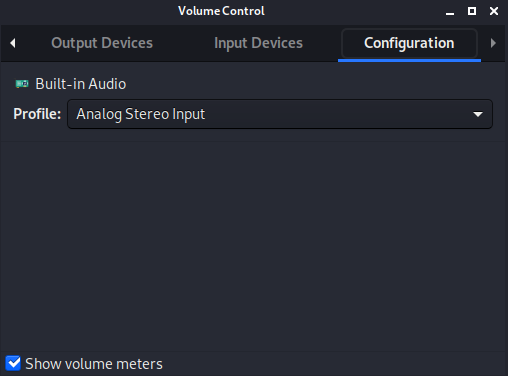
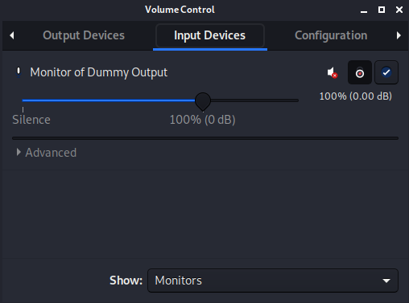
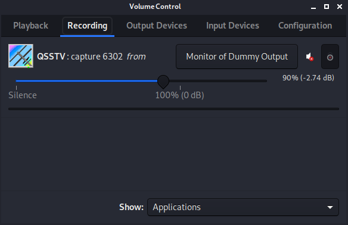
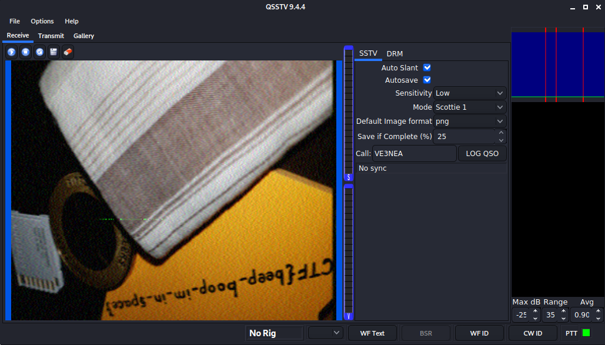
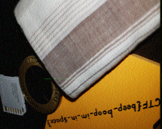

# Cryptography - m00nwalk (250 points)

## Challenge

*Decode this [message](./message.wav) from the moon. You can also find the file in /problems/m00nwalk_2_ddfd37932ded29f58963e8d9c526c2fa.*

Hints:

* *How did pictures from the moon landing get sent back to Earth?*
* *What is the CMU mascot?, that might help select a RX option*

## Flag

picoCTF{beep_boop_im_in_space}

## Walkthrough

The hints are helping a lot here, and after some search [here](https://en.wikipedia.org/wiki/Apollo_11#Films_and_documentaries) and [here](https://en.wikipedia.org/wiki/Apollo_11_missing_tapes), we learn that SSTV (Slow-Scan Television) was the protocole used to transmit pictures from the moon landing to earth.

So now for the hard work, we have to find a SSTV decoder for our WAV file. We are going to use `qsstv` (SSTV decoder), `pavucontrol` (to redirect sound output to sound input) and `VLC` (audio player with output interface selection) on KALI Linux, with the help of [this](https://charlesreid1.com/wiki/Qsstv) tutorial:

```bash
root@kali:~# apt install qsstv pavucontrol vlc
root@kali:~# qsstv
```

`pavucontrol` has to be tweaked a little, so that the audio output of VLC is redirected through a dummy output to the sound input:





The mascot of [CMU](https://en.wikipedia.org/wiki/Carnegie_Mellon_University) (Carnegie Mellon University) is Scotty the Scottish Terrier. We have all required information to decode the audio message, and after a some trials for `qsstv` configuration:



The flag is written in the image:


