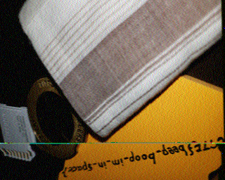

# Cryptography - m00nwalk2 (300 points)

## Challenge

*Revisit the last transmission. We think this [transmission](./message.wav) contains a hidden message. There are also some clues [clue 1](./clue1.wav), [clue 2](./clue2.wav), [clue 3](./clue3.wav). You can also find the files in /problems/m00nwalk2_3_cb4b7c47a2855206a42ef71363613bce.*

Hints:

* *Use the clues to extract the another flag from the .wav file*

## Flag

picoCTF{the_answer_lies_hidden_in_plain_sight}

## Walkthrough

As for m00nwalk1, we are going to use `qsstv` (SSTV decoder), `pavucontrol` (to redirect sound output to sound input) and `VLC` (audio player with output interface selection) on KALI Linux, with the help of [this](https://charlesreid1.com/wiki/Qsstv) tutorial:

```bash
root@kali:~# apt install qsstv pavucontrol vlc
root@kali:~# qsstv
```

`pavucontrol` has to be tweaked a little, so that the audio output of VLC is redirected through a dummy output to the sound input:


The mascot of [CMU](https://en.wikipedia.org/wiki/Carnegie_Mellon_University) (Carnegie Mellon University) is Scotty the Scottish Terrier. We have all required information to decode the audio message, and after a some trials for `qsstv` configuration:


We got the following images (you may have to play a little with the input devices volume in `pavucontrol`):

**message.wav**



**clue1.wav**


**clue2.wav**


**clue3.wav**


After a quick search based on the third clue content, we assume that some [stego](https://futureboy.us/stegano/) is used here. Let's try the password given by clue 1 using the original message:

```bash
root@kali:~/Downloads# steghide extract -sf message.wav
Enter passphrase:
wrote extracted data to "steganopayload12154.txt".
root@kali:~/Downloads# cat steganopayload12154.txt
picoCTF{the_answer_lies_hidden_in_plain_sight}
```
