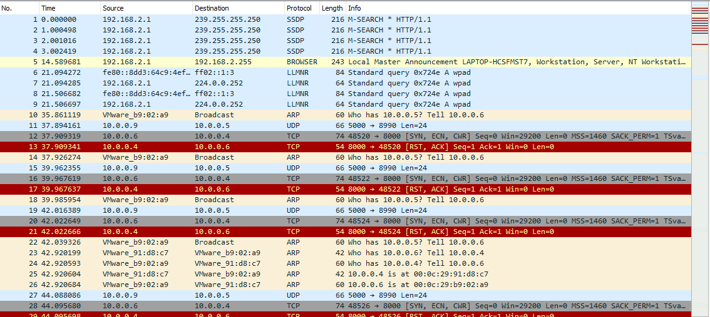
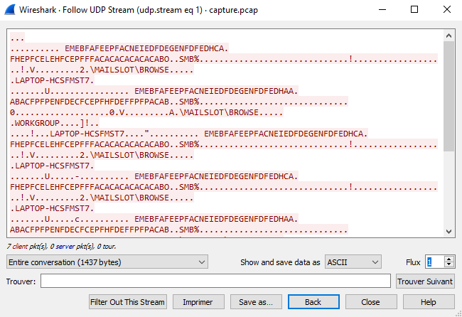
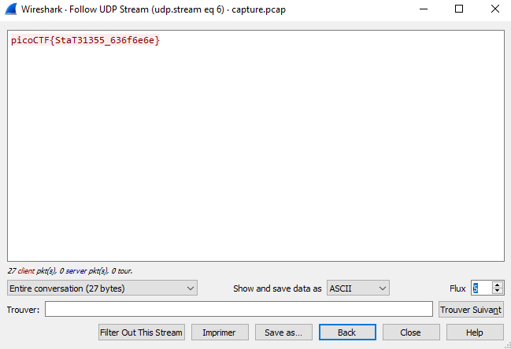

# Cryptography - shark on wire 1 (150 points)

## Challenge

*We found this [packet capture](./capture.pcap). Recover the flag. You can also find the file in /problems/shark-on-wire-1_0_13d709ec13952807e477ba1b5404e620.*

## Flag

picoCTF{StaT31355_636f6e6e}

## Walkthrough

Download [Wireshark](https://www.wireshark.org/#download) and open `capture.pcap`:

Lots of useless things in here, but somme interesting UDP packets. Let's follow those exchanges with Wireshark:

Until stream 6:

