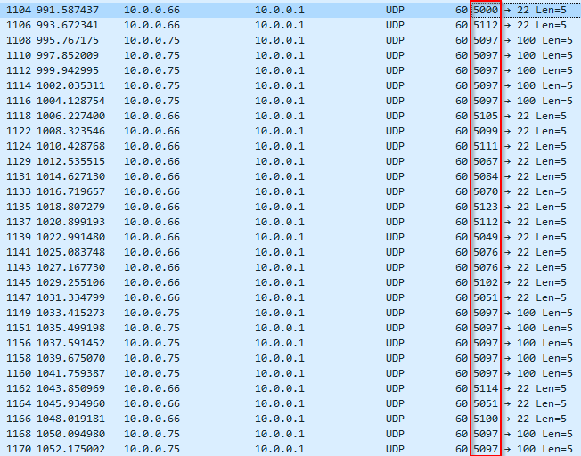

# Cryptography - shark on wire 2 (300 points)

## Challenge

*We found this [packet capture](./capture.pcap). Recover the flag that was pilfered from the network. You can also find the file in /problems/shark-on-wire-2_0_3e92bfbdb2f6d0e25b8d019453fdbf07.*

## Flag

picoCTF{p1LLf3r3d_data_v1a_st3g0}

## Walkthrough

After some investigations on the capture, the flag does not seem to be easily findable in the packets content, aven after reconstructing each TCP and UDP flows. After thorough analysis (and honestly a lot of guessing), some UDP packets seems weird (wireshark filter applied: *udp && !ssdp && !mdns && !ntp*).



Those source port numbers are really strange and surpisingly similar to well-known ASCII value: the last three digits are always comprised between 49 and 125. Let's try to keep those digits (after removing unnecessary packets from port 5000 and 5097) and convert them to ASCII:

```text
112 105 099 111 067 084 070 123 112 049 076 076 102 051 114 051 100 095 100 097 116 097 095 118 049 097 095 115 116 051 103 048 125
```

Which gives us the flag: picoCTF{p1LLf3r3d_data_v1a_st3g0}
