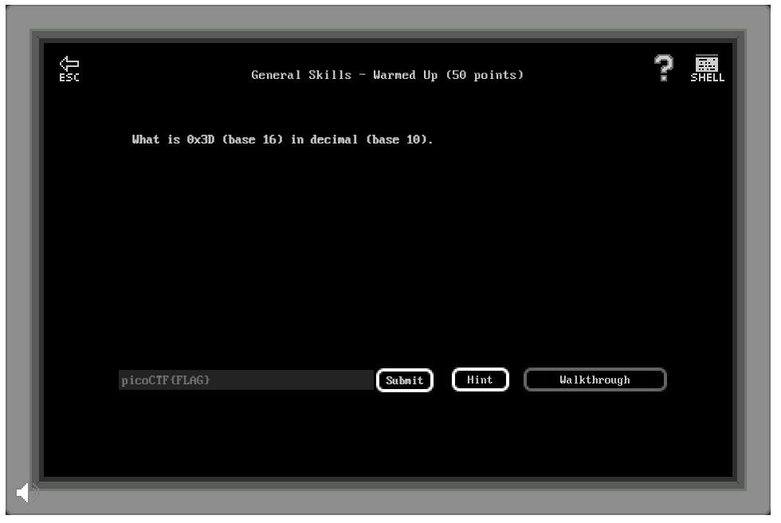

# General Skills - 2Warm (50 points)

## Challenge

*Can you convert the number 42 (base 10) to binary (base 2)?*

## Flag

picoCTF{61}

## Walkthrough

0x3D peut être converti en binaire (0011 1101) puis en décimal (61).
