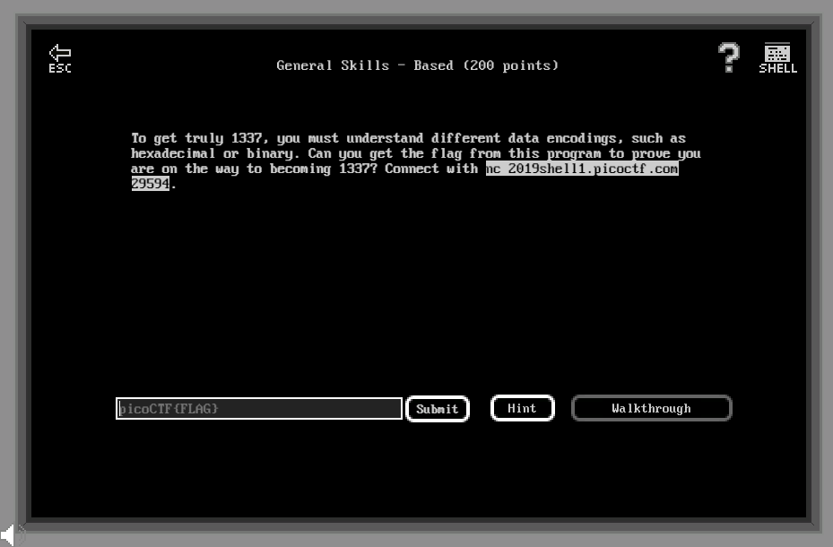

# General Skills - Based (200 points)

## Challenge

*To get truly 1337, you must understand different data encodings, such as hexadecimal or binary. Can you get the flag from this program to prove you are on the way to becoming 1337? Connect with nc 2019shell1.picoctf.com 29594.*



## Flag

picoCTF{learning_about_converting_values_e67b1990}

## Walkthrough

Le endpoint *2019shell1.picoctf.com 29594* impose une série de conversion vers de l'ASCII, le résultat de la conversion doit être saisi à chaque étape en moins de 45 secondes :

* Binary ==> ASCII
* Octal ==> ASCII
* Hex ==> ASCII

Le challenge peut être réalisé avec l'aide du site [https://www.rapidtables.com/convert/number/ascii-hex-bin-dec-converter.html](https://www.rapidtables.com/convert/number/ascii-hex-bin-dec-converter.html).

```bash
m3oow@pico-2019-shell1:/problems/strings-it_5_1fd17da9526a76a4fffce289dee10fbb$ nc 2019shell1.picoctf.com 29594
Let us see how data is stored
colorado
Please give the 01100011 01101111 01101100 01101111 01110010 01100001 01100100 01101111 as a word.
...
you have 45 seconds.....

Input:
colorado
Please give me the  154 151 172 141 162 144 as a word.
Input:
lizard
Please give me the 6f76656e as a word.
Input:
oven
You've beaten the challenge
Flag: picoCTF{learning_about_converting_values_e67b1990}
```
