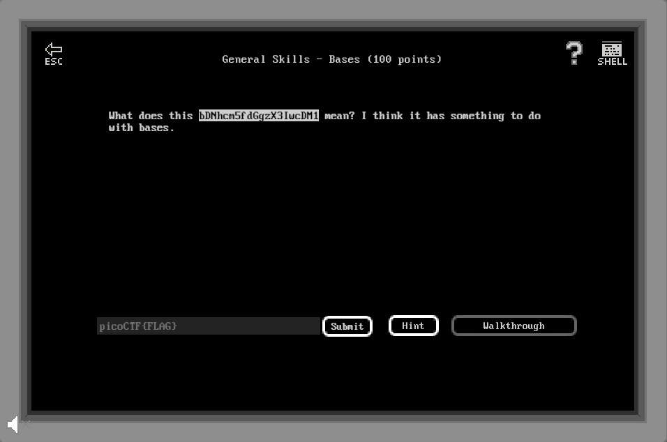

# General Skills - Bases (100 points)

## Challenge

*What does this bDNhcm5fdGgzX3IwcDM1 mean? I think it has something to do with bases.*

## Flag

picoCTF{l3arn_th3_r0p35}

## Walkthrough

Le flag est encodé en Base64, une conversion Base64 vers ASCII est suffisante.
