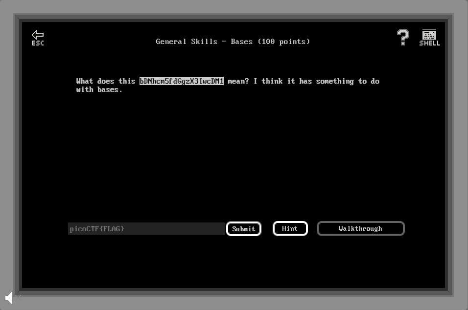

# General Skills - Bases (100 points)

## Challenge

*What does this bDNhcm5fdGgzX3IwcDM1 mean? I think it has something to do with bases.*

## Flag

picoCTF{l3arn_th3_r0p35}

## Walkthrough

The flag is Base64 encoded, a Base64 to ASCII conversion (using for example Notepad++ plugin or the shell command `#echo bDNhcm5fdGgzX3IwcDM1 | base64 -d`).
