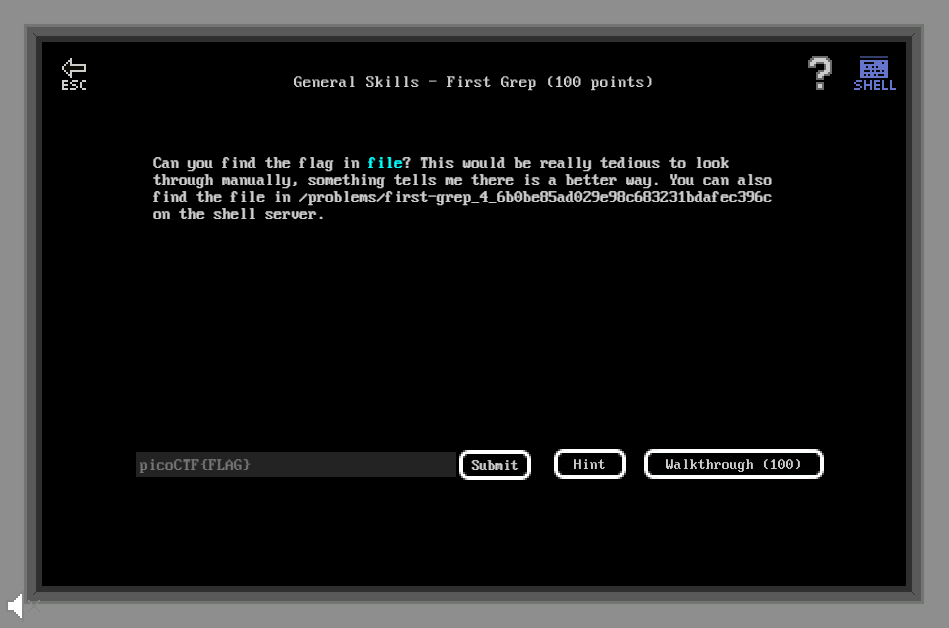

# General Skills - First Grep (100 points)

## Challenge

*Can you find the flag in file? This would be really tedious to look through manually, something tells me there is a better way. You can also find the file in /problems/first-grep_4_6b0be85ad029e98c683231bdafec396c on the shell server.*



## Flag

picoCTF{grep_is_good_to_find_things_ad4e9645}

## Walkthrough

Le challenge consiste à effectuer un grep du flag dans un répertoire donné en énoncé :

```bash
m3oow@pico-2019-shell1:~$ grep -i "picoCTF{" /problems/first-grep_4_6b0be85ad029e98c683231bdafec396c/*
picoCTF{grep_is_good_to_find_things_ad4e9645}
```
