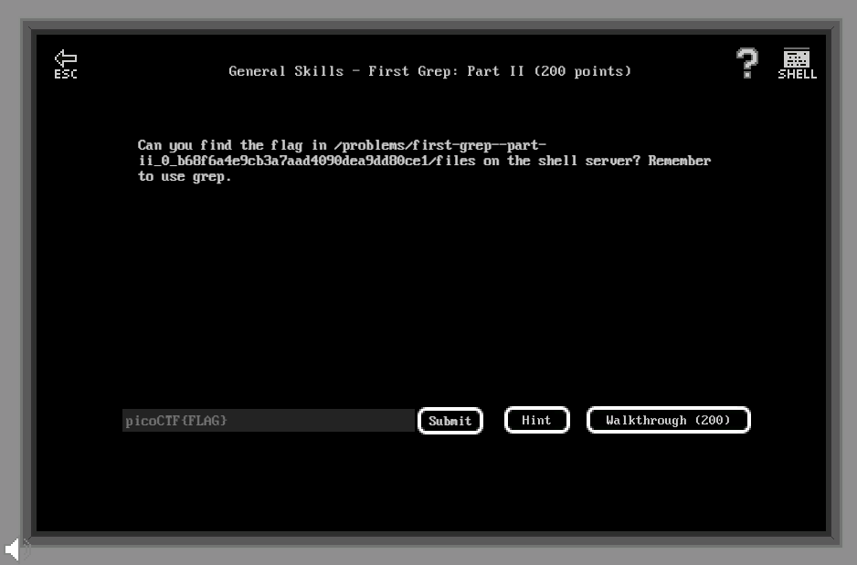

# General Skills - First Grep: Part II (200 points)

## Challenge

*Can you find the flag in /problems/first-grep--part-ii_0_b68f6a4e9cb3a7aad4090dea9dd80ce1/files on the shell server? Remember to use grep.*



## Flag

picoCTF{grep_r_to_find_this_e4fa3ba7}

## Walkthrough

Le challenge consiste à effectuer un grep récursif du flag dans un répertoire donné en énoncé :

```bash
m3oow@pico-2019-shell1:/problems/strings-it_5_1fd17da9526a76a4fffce289dee10fbb$ grep -ri "picoctf{" /problems/first-grep--part-ii_0_b68f6a4e9cb3a7aad4090dea9dd80ce1/files/*
/problems/first-grep--part-ii_0_b68f6a4e9cb3a7aad4090dea9dd80ce1/files/files9/file26:picoCTF{grep_r_to_find_this_e4fa3ba7}
```
