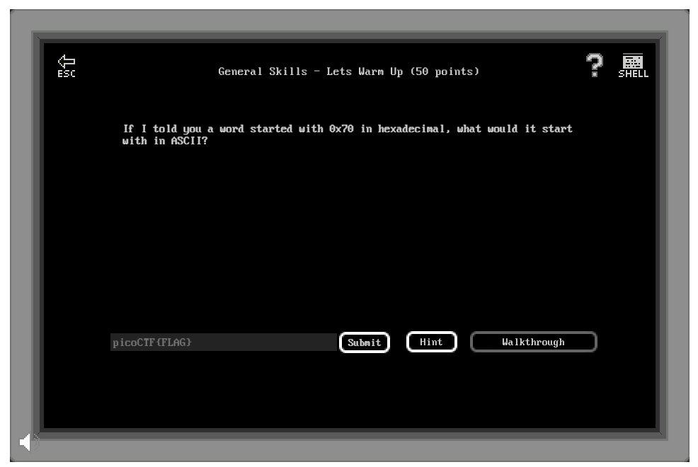

# General Skills - Lets Warm Up (50 points)

## Challenge

*If I told you a word started with 0x70 in hexadecimal, what would it start with in ASCII?*

## Flag

picoCTF{p}

## Walkthrough

0x70 is the Hex code for "p" letter in ASCII ([asciitable.com](http://www.asciitable.com/)).
