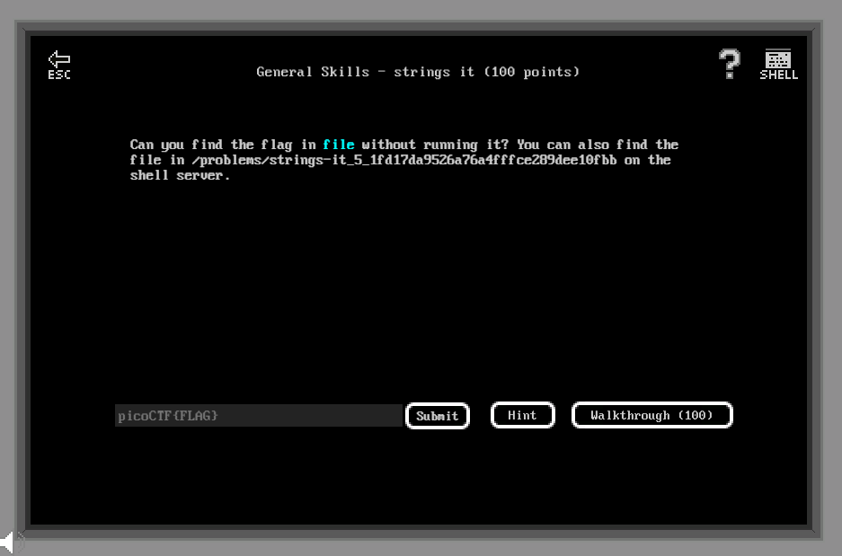

# General Skills - Strings it (100 points)

## Challenge

*Can you find the flag in file without running it? You can also find the file in /problems/strings-it_5_1fd17da9526a76a4fffce289dee10fbb on the shell server.*



## Flag

picoCTF{5tRIng5_1T_dd38f284}

## Walkthrough

For this challenge, you have to go through each string of a binary file to find the flag using `strings` and `grep` :

```bash
m3oow@pico-2019-shell1:/problems/strings-it_5_1fd17da9526a76a4fffce289dee10fbb$ strings strings | grep -i "picoctf{"
picoCTF{5tRIng5_1T_dd38f284}
```
