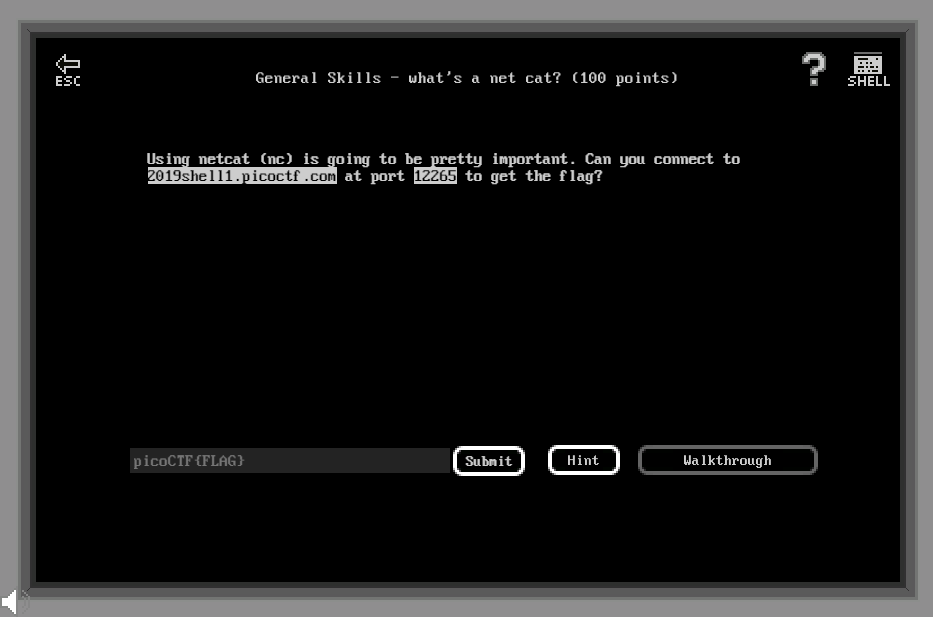

# General Skills - What's a net cat? (100 points)

## Challenge

*Using netcat (nc) is going to be pretty important. Can you connect to 2019shell1.picoctf.com at port 12265 to get the flag?.*



## Flag

picoCTF{nEtCat_Mast3ry_74df27a3}

## Walkthrough

Utiliser la commande Netcat `nc` pour se connecter au *serveur:port* renseignés dans l'énoncé :

```bash
m3oow@pico-2019-shell1:/problems/strings-it_5_1fd17da9526a76a4fffce289dee10fbb$ nc 2019shell1.picoctf.com 12265
You're on your way to becoming the net cat master
picoCTF{nEtCat_Mast3ry_74df27a3}
```
