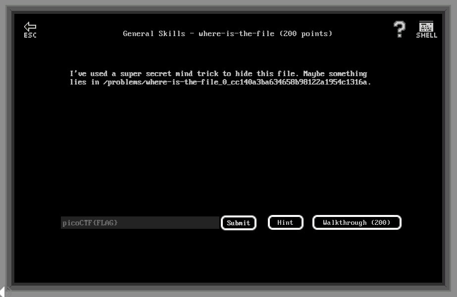

# General Skills - where-is-the-file (200 points)

## Challenge

*I've used a super secret mind trick to hide this file. Maybe something lies in /problems/where-is-the-file_0_cc140a3ba634658b98122a1954c1316a.*



## Flag

picoCTF{w3ll_that_d1dnt_w0RK_b2dab472}

## Walkthrough

A file is hidden inside the repository using dot notation :

```bash
m3oow@pico-2019-shell1:/problems/where-is-the-file_0_cc140a3ba634658b98122a1954c1316a$ ls -al
total 80
drwxr-xr-x   2 root       root        4096 Sep 28 22:05 .
drwxr-x--x 684 root       root       69632 Oct 10 18:02 ..
-rw-rw-r--   1 hacksports hacksports    39 Sep 28 22:05 .cant_see_me
```

THe flag is inside *_*.cant_see_me* :

```bash
m3oow@pico-2019-shell1:/problems/where-is-the-file_0_cc140a3ba634658b98122a1954c1316a$ cat .cant_see_me
picoCTF{w3ll_that_d1dnt_w0RK_b2dab472}
```
